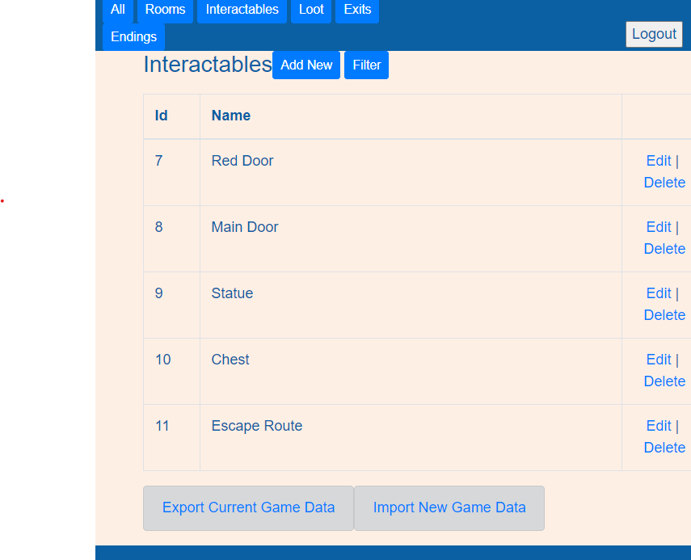

<!-- PROJECT LOGO -->
<br />
<div align="center">

<h3 align="center">Resident Mystery: Text Based Adventure Game Engine</h3>

  <p align="center">
      This is a game engine for text based adventure games, built in Java using SpringBoot and Thymeleaf.<br>
      It allows for the development of games consisting of rooms containing interactable objects, lootable items, and NPCs.<br>
      It includes various features such as lockable doors between rooms, NPCs able to wander between unlocked rooms, NPCs offering quests and more.<br>
      All game development can be performed via front end UI, or by importing/exporting objects as JSON strings.
  </p>
</div>


<!-- TABLE OF CONTENTS -->
<details>
  <summary>Table of Contents</summary>
  <ol>
    <li>
      <a href="#about-the-project">About The Project</a>
      <ul>
        <li><a href="#built-with">Built With</a></li>
      </ul>
    </li>
    <li><a href="#getting-started">Getting Started</a></li>
    <li><a href="#usage">Usage</a></li>
    <li><a href="#contact">Contact</a></li>
  </ol>
</details>


<!-- ABOUT THE PROJECT -->
## About The Project

Resident Mystery is a game engine for text based adventure games.<br>
It allows for the creation of games consisting of interconnected rooms, with interactable objects, lootable items, npcs, and many other features.<br>
For example, an interactable object can require a lootable item to be unlocked, and when unlocked can remotely unlock another object such as a doorway.<br><br>
Game states are saved to user IDs, and will allow users to resume their play from the point they were at when logging back into the game.<br><br>
The application includes a full administration interface, allowing for the development of the game while the app is running. Users already playing will pick up any updates when restarting their games.<br>
This functionality allows the current game data to be exported to a JSON string for backups/external editing, and allows it to be imported in the same format.<br>
Also provided are full front end interfaces for adding, editing, and removing game elements.
<br><br>
The application interfaces with a MySQL database to store game data, and serves front end pages for playing the game, as well as the main website homepage.
<p align="right">(<a href="#top">back to top</a>)</p>


### Built With

* [Java 11](https://www.oracle.com/java/technologies/javase/jdk11-archive-downloads.html)
* [Spring Boot](https://spring.io/projects/spring-boot)
* [Maven](https://maven.apache.org/)
* [Gson](https://github.com/google/gson)
* [Thymeleaf](https://www.thymeleaf.org/)
* [Bootstrap](https://getbootstrap.com)


<p align="right">(<a href="#top">back to top</a>)</p>


<!-- GETTING STARTED -->
## Getting Started

### Installation
1. Clone the repo
   ```sh
   git clone https://github.com/suracki/residentmystery.git
   ```
2. Start the application running in Docker
   Ensure that Docker is installed and running
   ```
   https://docs.docker.com/get-docker/
   ```
   Use the provided docker-compose.yml to build and start the application
   ```
   docker-compose up -d
   ```
3. Access the application via web browser
   Once the application is running it can be accessed via web browser
   ```
   Default:
   https://localhost:8080


<p align="right">(<a href="#top">back to top</a>)</p>


<!-- USAGE EXAMPLES -->
## Usage

### Front End

The application serves a Front End UI using Thymeleaf and Bootstrap, which can be accessed via the following URLs:

/ -> Main homepage, welcome page with links to guide user through interface<br>
/admin/landing -> Admin landing/homepage<br>
/game/start -> Game landing/start page<br>


The game's home page. Allowing users to start/login, register a new user, or request a password reset<br>


Example gameplay screen; exploring a room. The room's description and contents are visible, items and other interactions are displayed as links<br>


Example game management screen. Lists objects currently in game data, can be filtered by object type/<br>

<p align="right">(<a href="#top">back to top</a>)</p>


<!-- CONTACT -->
## Contact

Simon Linford - simon.linford@gmail.com

Project Link: [https://github.com/Suracki/residentmystery](https://github.com/Suracki/residentmystery)

<p align="right">(<a href="#top">back to top</a>)</p>
